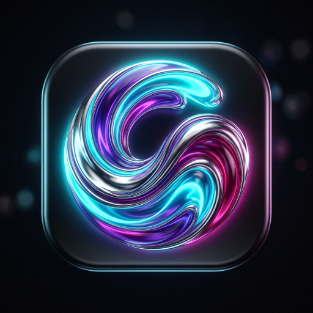

# VibeFlow 2

A premium, highly-optimized Live Wallpaper Engine for Android. VibeFlow 2 combines physics-based fluid dynamics, real-time audio reactivity, and context-aware styling with a built-in AGSL Shader Creator to turn your home screen into an interactive digital canvas.

<p align="center">
  
</p>

<p align="center">
  
  
  
  
</p>

---

## Core Engine Features

*   **Native AGSL Shading:** Powered by Android Graphics Shading Language for near-zero CPU overhead and buttery-smooth rendering.
*   **Curated Visual Styles:**
    *   *Pure Chrome:* Raytraced liquid metallic folds with deep brushed reflections.
    *   *Iridescent Pearl:* Mother-of-pearl shifting pastel fluid style.
    *   *Cosmic Plasma:* Swirling high-density procedural space nebula.
    *   *Frosted Aurora:* Shimmering bands of northern lights filtered through textured frost.
*   **Real-time Audio Visualizer:** High-performance FFT analysis translates system audio into fluid wave displacement.
*   **Gyroscope Parallax:** Responsive 3D depth shifting that reacts instantly to device tilt.
*   **Context-Aware Environments:** Gradual lighting transitions synced with your local time of day (Sunrise, Noon, Sunset, Night).
*   **Pro Tuning Dashboard:** Precise sliders for Animation Speed, Fluid Viscosity, Particle Count, Wave Scale, Parallax Intensity, Contrast, and Bloom.

---

## Built-in Custom Shader Creator

Write, compile, and run your own custom AGSL fragment shaders directly on your device with instant GPU hot-reloading.

*   **Custom Shader Library:** Save shaders with unique names — persisted locally and automatically surfaced in the Themes tab.
*   **Import & Share:** Import shader code from your clipboard, or share shaders via the native Android Share Sheet.
*   **Overwrite Protection:** Confirmation dialog prevents accidentally discarding unsaved code when loading templates or saved shaders.
*   **Resilient Hot-Reloading:** On shader compile errors the engine keeps running on the last successfully compiled shader instead of blacking out.
*   **Clear Editor:** One-tap button to wipe the code editor and start fresh.

---

## Engineering & Battery Optimization

*   **No Active Polling:** Event-driven `MediaController.Callback` listeners instead of state-checking threads for album art color extraction.
*   **Frame Capping:** Battery Saver Mode locks the framerate to 30 FPS and disables heavy post-processing.
*   **Native Wallpaper Lifecycle:** Rendering halts completely when the screen is off or another app goes fullscreen.

> [!NOTE]
> A high-end GPU (e.g. Snapdragon 8 Gen 1 or equivalent) is recommended for fluid simulation with high viscosity settings and Bloom enabled.

---

## Setup & Installation

### Requirements
*   **Android Studio** Jellyfish / Koala or newer
*   **Android SDK 33+** — Android 13+ is required for AGSL shader execution
*   **Gradle 8.0+**

### Build Steps

1.  **Clone the repository:**
    ```bash
    git clone https://github.com/theStxve/vibeFlow2.git
    ```
2.  **Open in Android Studio** and allow Gradle to sync.
3.  **Deploy** the `app` configuration to a physical device or emulator running Android 13+.

> [!IMPORTANT]
> If you dont want to build this app from source you can download the APK from the [Releases](https://github.com/theStxve/vibeFlow2/releases) page.

---

## License & Disclaimers

*   Licensed under the MIT License. See [LICENSE](LICENSE) for details.
*   See [SPOTIFY_DISCLAIMER](SPOTIFY_DISCLAIMER.md) for details on the Spotify integration.
